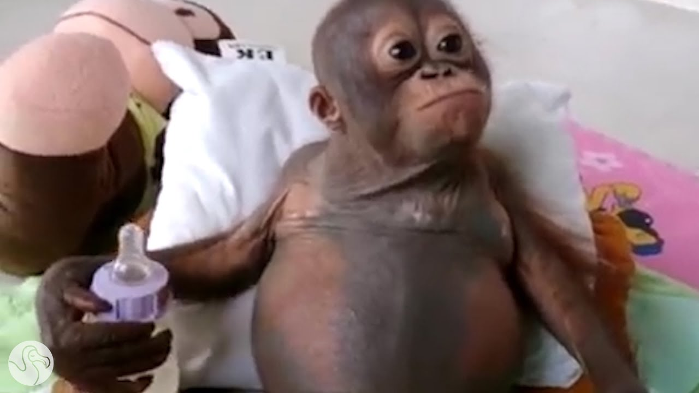

<a href="https://www.internationalanimalrescue.org/projects/orangutan/budi">
    
</a>

<br>
<br>

```php
init() {
    profile = SpawnStruct();
    profile.name = "Budiworld";
    profile.languages = [ "Python", "Javascript", "Rust", "GSC" ];
    profile.currentProjects = [ "T6HTTPLib", "iw4m", "achievements" ];
    profile.status = "AFK";

    thread printWelcomeMessage( profile );
}

printWelcomeMessage( profile ) {
    self IPrintLn( "^2Welcome to my GitHub profile!" );
    self IPrintLn( "^1Status:^7 " + profile.status );
    self IPrintLn( "^3Currently working on:^7 " + profile.currentProjects[randomInt(self.projects.size)] );
    self IPrintLn( "^5Coding languages:^7 " + profile.languages );
}
```

**Yalla!** 👋 A full time **pale skin bum** here, I specialize in making **pointless scripts** for **dead**ass games like **Black Ops II** (Plutonium T6)🐒
